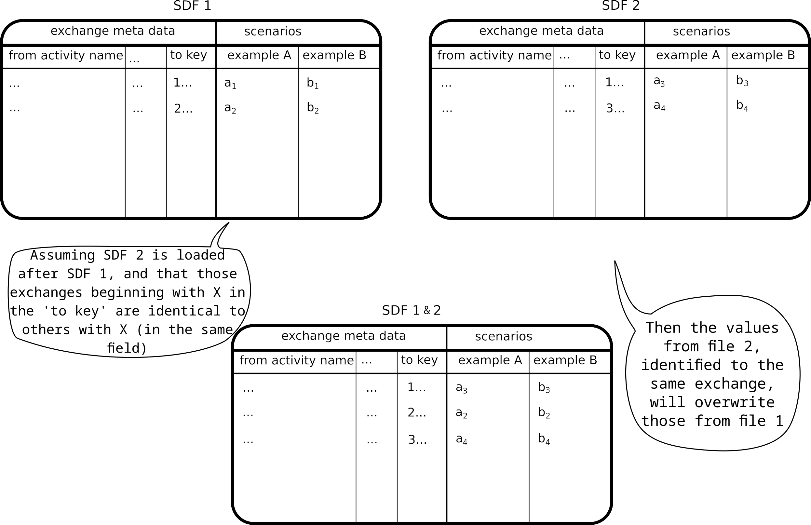

> [!IMPORTANT]
> This wiki section is __incomplete__ or __outdated__.
> 
> Please help us improve the wiki by reading our
> [contributing guidelines](https://github.com/LCA-ActivityBrowser/activity-browser/blob/main/CONTRIBUTING.md#wiki).

## Combining Scenario Files
You can work with multiple scenario files for which there are with two options:

### Product combinations
The option `Combine scenarios` will calculate every combination between scenarios, it adds more scenarios. 
This yields all possible scenario combinations, e.g. file 1: <i>A, B</i> and file 2: <i>X, Y</i> yields <i>A-X, A-Y, 
B-X and B-Y</i>, as shown in the figure below. 

### Extend combinations
The option `Extend scenarios` will combine scenarios with the same name into a larger single scenario, 
it makes the existing scenarios larger.
Scenarios from file 2 extend scenarios of file 1, e.g.  file 1: <i>A, B</i> and file 2: <i>A, B</i> yields <i>A-B</i>,
as shown in the figure below.

> [!IMPORTANT]
> This is only possible if scenario names are **identical** in all files, e.g. everywhere <i>A, B</i>).

## Video overview of modelling and calculating scenarios

<b>Note:</b> some content of the video may be outdated. Written content should be more up-to-date.

