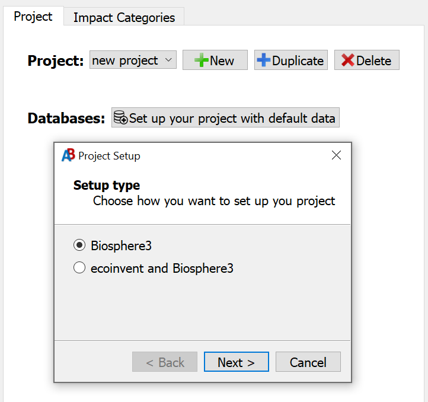
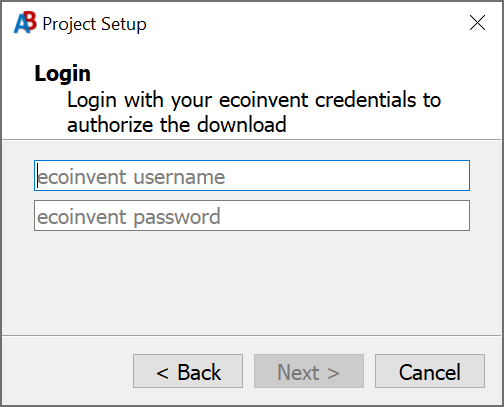
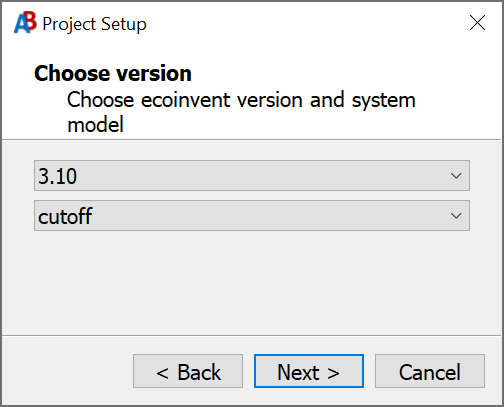
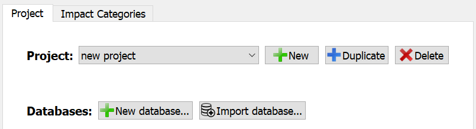

[Learn how to install Activity Browser...](Installation-Guide)

## Starting Activity Browser
First activate the environment where the activity browser is installed:

```bash
conda activate ab
```

Then simply run `activity-browser` and the application will open.

## Understanding Activity Browser terms
Activity Browser uses [Brightway](https://docs.brightway.dev/en/latest/) for its data management and calculations. 
Brightway has its own 'accent' of LCA terms,
you can compare LCA terms from Brightway, [ISO 14044 (2006)](https://www.iso.org/standard/38498.html) and others in the
[Brightway Glossary](https://docs.brightway.dev/en/latest/content/overview/glossary.html).

## Organization of data in Brightway and Activity Browser
Data in Brightway is organized into projects
- Projects contain databases, impact categories, calculation setups and more
  - DatabasesPane contain activities (biosphere and technosphere)
    - Activities are the building blocks of your LCA model 
- Impact categories are used to score your LCA models against
- Calculation setups are the combinations of reference flows and impact categories that you can calculate
- Projects also contain other data, such as parameters and plugin settings.


<sup>
_Image copied from the
[Brightway documentation](https://docs.brightway.dev/en/latest/content/theory/structure.html#brightway-objects)._
</sup>

Read more about how data is organized in the 
[Brightway documentation](https://docs.brightway.dev/en/latest/content/theory/structure.html#brightway-objects).

## User interface
Activity Browser is organized in two panels, which themselves have tabs and a menu bar. 
The left panel has a `Project` tab and an `Impact Categories` tab.
The right panel has the `Welcome` screen, `LCA setup` tab, `Parameters` tab and -if used- an `LCA Results` tab.

The [`Project`](Projects) tab shows your current project, the databases in that project and the contents of a database if it is open.
The [`Impact Categories`](Impact-Categories) tab shows all impact categories that are installed in the current project.
The [`LCA Setup`](LCA-Calculation-Setups) tab allows you to define reference flows, impact categories and scenarios for calculations.
The [`Parameters`](Parameters) tab allows you to manage your parameters.
The [`LCA Results`](LCA-Results) tab shows the results of the calculations you do.
Finally, the menu bar at the top allows you to manage Activity Browser, Plugins and Project settings.

## Setting up a project

### Video overview of project setup

[](https://www.youtube.com/watch?v=qWzaQjAf8ZU)

<sup>
<b>Note:</b> some content of the video may be outdated. Written content should be more up-to-date.
</sup>

### Installing a biosphere and impact categories
In the `Project` tab there is initially a button called `Set up your project with default data`. 
Click this button to add the default data. 
This adds a `biosphere` database which contains a number of standardized biosphere flows 
and compatible impact categories.



#### Setting up with Biosphere3 data
You can choose a biosphere version, which will install a biosphere database and compatible impact categories.

> [!IMPORTANT]
> In case you want to install ecoinvent later, choosing a biosphere version will make your project compatible with 
> **only** the version of biosphere you install.
> e.g. installing biosphere `3.6` will make your project only compatible with ecoinvent `3.6` databases.
> 
> Setting the biosphere version is **permanent** for a project, you cannot change this version later.
> 
> If you do not plan on using ecoinvent in this project, don't worry about this and choose the highest version.


#### Setting up with ecoinvent data
If you have a valid ecoinvent license and login information, you can immediately set up ecoinvent in your project with all 
relevant and compatible data. 
You can then choose the database version and system model.

 


[Read more about projects...](Projects)

## LCI databases
After adding the default data, you can create or import a database with the `New` and `Import Database` buttons.



### New databases
With `New` you can create a completely empty database with any given name and
enter your own activity data.

[Read more about activities...](Activities)

### Importing databases
Clicking 'Import' will open a new dialog that will allow you to select how you want to import data into brightway 
(and by extension, the Activity Browser).
There are two main options: 'remote data' and 'local data':

<details><summary><b>Remote database import</b></summary>

We currently support 2 remote databases, Ecoinvent and Forwast:

#### Importing Ecoinvent
[**Ecoinvent**](https://ecoinvent.org/) is a paid database you can install directly in Activity Browser if you have a 
valid ecoinvent license and login information.

#### Importing Forwast
[**Forwast**](http://forwast.brgm.fr/) is a free database you can install directly in Activity Browser.
___
</details>

<details><summary><b>Local database import</b></summary>

We support various local import methods
- Local 7z-archive of ecospold2 files
- Local directory of ecospold2 files
- Local Excel file
- Local Brightway database file
___
</details>

[Read more about databases...](Databases)

### Video overview of working with Activities in DatabasesPane

[](https://www.youtube.com/watch?v=2rmydYdscJY)

<sup>
<b>Note:</b> some content of the video may be outdated. Written content should be more up-to-date.
</sup>

[Read more about activities...](Activities)

## Running an LCA calculation
To run an LCA, you must first create a calculation setup, add at least one reference flow and one impact category 
to be able to calculate results.

### Video overview of calculating LCA results

[](https://www.youtube.com/watch?v=J94UehVQM-Q)

<sup>
<b>Note:</b> some content of the video may be outdated. Written content should be more up-to-date.
</sup>

[Read more about LCA calculation setups...](LCA-Calculation-Setups)

[Read more about LCA results...](LCA-Results)

[Follow a tutorial to do your first LCA...](Tutorials#your-first-lca)

## Additional Resources
- [Youtube tutorials](https://www.youtube.com/channel/UCsyySKrzEMsRFsWW1Oz-6aA/)
- [Introduction video by ETH Zurich](https://www.youtube.com/watch?v=j3uLptvsxeA)
- [AB Discussions page](https://github.com/LCA-ActivityBrowser/activity-browser/discussions)
- [AB scientific article](https://doi.org/10.1016/j.simpa.2019.100012)
- The AB has two mailing lists, for [updates](https://brightway.groups.io/g/AB-updates) and [user exchange](https://brightway.groups.io/g/AB-discussion)
- [Brightway2](https://brightway.dev/)
- [Global Sensitiviy Analysis paper](https://onlinelibrary.wiley.com/doi/10.1111/jiec.13194) describing GSA as implemented in the AB; see also our [wiki](https://github.com/LCA-ActivityBrowser/activity-browser/wiki/Global-Sensitivity-Analysis)
- [Modular LCA paper](https://link.springer.com/article/10.1007/s11367-015-1015-3); [documentation modular LCA](http://activity-browser.readthedocs.io/en/latest/index.html)
