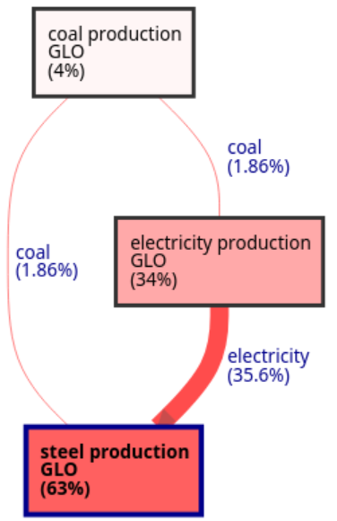

> [!IMPORTANT]
> This wiki section is __incomplete__ or __outdated__.
> 
> Please help us improve the wiki by reading our
> [contributing guidelines](https://github.com/LCA-ActivityBrowser/activity-browser/blob/main/CONTRIBUTING.md#wiki).

## Overview

### Inventory

### LCA overview results

### Score matrix

## Contribution Analysis
### Differences between approaches
Activity Browser has two contribution analysis approaches available to assess results, 
`Elementary Flow (EF) Contributions` and `Process contributions`.

Before we discuss the different approaches, we introduce a small example for the production of _'steel'_:

The amounts we use are:

| activity               | product            | technosphere exchanges          | biosphere exchanges      | 
|------------------------|--------------------|---------------------------------|--------------------------|
| coal production        | 10 kg coal         |                                 | 0.02 kg CH4   |
| electricity production | 10 kWh electricity | 10 kg coal                      | 10.808 kg CO2 |
| steel production       | 10 kg steel        | 5 kWh electricity 5 kg coal | 10 kg CO2     |

<b>Note:</b> These numbers are used for ease of understanding, not for realism.

To produce 1 kg of steel, we get a climate change impact of 1.6 kg CO2 eq with the _'IPCC 2021'_ impact category.
In the way Brightway (and thus Activity Browser) calculate results, a _contribution matrix_ is calculated with 
all impacts _from_ all EFs and all activities. 
For the system and functional unit above, this would be:

|                       | coal prod. | elec. prod. | steel prod. |
|-----------------------|------------|-------------|-------------|
| <b>CO2</b> | -          | 0.5404...   | 1           |
| <b>CH4</b> | 0.0596...  | -           | -           |

The _contribution matrix_ show the dis-aggregated results for each individual biosphere flow for each activity.

#### EF contributions
If we take sum the _rows_ to one row, we get the EF contributions 
(the contribution of all CO2 and CH4 impacts together).
In the case above, the EF contributions are:
- CO2: 1.5404... (96.3%)
- CH4: 0.0596... (3.7%)

#### Process contributions
If we take the sum of the _columns_ to one column, we get the process contributions
(the contribution of all coal, electricity and steel production impacts together).
In the case above, the process contributions are:
- coal production: 0.0596... (3.7%)
- electricity production: 0.5404... (62.5%)
- steel production: 1 (33.8%)

To summarize, the difference between EF and process contributions is the direction the contribution matrix is summed.

### Manipulating results
In this section we generalize a little bit for the different contribution approaches,
we call the _from_ part of the contributions (the EFs or activities above) _entities_.

There are several ways Activity Browser manipulates your results by default.
- The results are **sorted** so that the largest (absolute) values are shown first
- A `cut-off` of 5% is applied to group all entities with an impact below that value.
- The contributions are _normalized_ to the impact of that reference flow, meaning they are show as a percentage, 
  counting up to 100%

These actions are taken to show you the most relevant results.

You can manually manipulate the contribution results in the next menu, which we explain bit by bit below.

#### Cut-off
You can manually change the `cut-off` of the results in two ways, `Relative` or `Top #`.
The `Relative` option shows contributions _from_ entities of _x_% or higher.
The `Top #` options shows contributions from the _x_ entities that contribute the most (as absolute).

You can change the value of the cut-off in the menu shown below.

#### Compare
The `Compare` menu allows you to compare different dimensions of results.
You can compare between:
- _Reference flows_
- _Impact categories_
- _Scenarios_ (only available in scenario LCA, see [scenarios](#scenarios))

The compare mode defines what is shown in the figure.

#### Aggregation
The `Aggregate by` menu can be used to _group_ results based on field names.
As an example, EF contributions can be grouped on the name, 
for example to group all flows with the same name.
Another example for process contributions can be grouped based on their reference product name.

#### Plot and Table
By default, Activity Browser shows a plot and a table. 
You can disable one of them if you want to focus on one of them.

#### Relative and Absolute
Finally, you can choose between `Relative` and `Absolute` results.
The `Relative` results will sum to 100%, the `Absolute` results will sum to the impact score.

## Sankey
The `Sankey` tab shows results from [graph traversal](https://docs.brightway.dev/projects/graphtools/en/latest/index.html).
Graph traversal calculates results step-by-step for _nodes_ (activites) in the _graph_ (supply chain/product system).

### Sankey configuration
In the `Sankey` tab, you can configure, you can set the 
Reference flow, Impact category and Scenario (only available in scenario LCA, see [scenarios](#scenarios)) to be shown.
you can also set a `cutoff` and `calculation depth` setting.

The `cutoff` setting will stop traversing the supply chain once the impact is below the percentage specified.
The `calculation depth` will stop traversing the supply chain once that number of calculations have been performed.

### Sankey results
In the Sankey, the red arrows show the _cumulative_ impact of the _product_ flow 
(_direct_ from that process and _indirect_ from all upstream processes involved in producing that product), 
the boxes show the _direct_ (process contribution) impact of that process.

Using the example above in the [contribution analysis](#contribution-analysis) section, we show the sankey below.
The [process contribution](#process-contributions) results are also shown in the boxes below.

## Other Results tabs
The Monte Carlo and Senstivity Analysis tabs are explained on the [Uncertainty](Uncertainty) page.

## Scenarios
