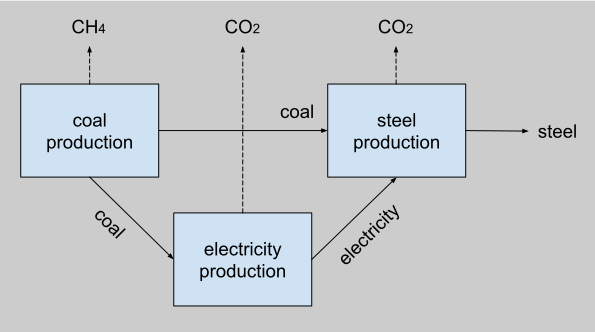
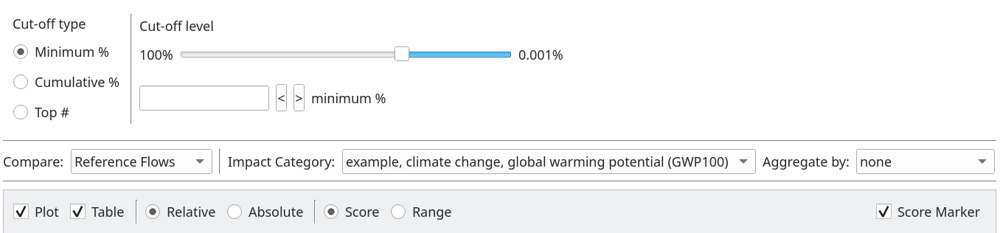
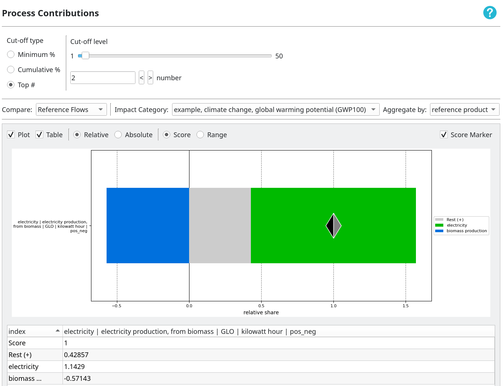
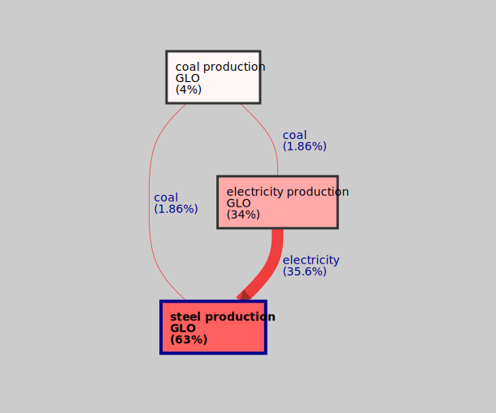

> [!IMPORTANT]
> This wiki section is __incomplete__ or __outdated__.
> 
> Please help us improve the wiki by reading our
> [contributing guidelines](https://github.com/LCA-ActivityBrowser/activity-browser/blob/main/CONTRIBUTING.md#wiki).

## Overview

### Inventory

### LCA overview results

### Score matrix

## Contribution Analysis
### Differences between approaches
Activity Browser has three contribution analysis approaches available to assess results, 
`Elementary Flow (EF) Contributions`, `Process contributions` and `First Tier (FT) Contributions`.

Before we discuss the different approaches, we introduce a small example for the production of _'steel'_:
These approaches are extensively discussed independent of Activity Browser by 
[van der Meide et al. (2025)](https://doi.org/10.31219/osf.io/sfgj6_v1) 
if you want to learn more.

The amounts we use are:

| activity               | product            | technosphere exchanges          | biosphere exchanges      | 
|------------------------|--------------------|---------------------------------|--------------------------|
| coal production        | 10 kg coal         |                                 | 0.02 kg CH4   |
| electricity production | 10 kWh electricity | 10 kg coal                      | 10.808 kg CO2 |
| steel production       | 10 kg steel        | 5 kWh electricity 5 kg coal | 10 kg CO2     |

<b>Note:</b> These numbers are used for ease of understanding, not for realism.

To produce 1 kg of steel, we get a climate change impact of 1.6 kg CO2 eq. with the 
_'IPCC 2021 GWP 100'_ impact category.
In the way Brightway (and thus Activity Browser) calculate results, a _contribution matrix_ is calculated with 
all impacts _from_ all EFs and all activities. 
For the system and functional unit above, this would be:

|                       | coal prod. | elec. prod. | steel prod. |
|-----------------------|------------|-------------|-------------|
| <b>CO2</b> | -          | 0.5404...   | 1           |
| <b>CH4</b> | 0.0596...  | -           | -           |

The _contribution matrix_ show the dis-aggregated results for each individual biosphere flow for each activity.

#### Elementary Flow (EF) contributions
If we take the sum the _rows_ to one column, we get the EF contributions 
(the contribution of all CO2 and CH4 impacts together).

In the case above, the EF contributions are:
- CO2: 1.5404... (96.3%)
- CH4: 0.0596... (3.7%)

#### Process contributions
If we take the sum of the _columns_ to one row, we get the process contributions
(the contribution of all coal, electricity and steel production impacts together).

In the case above, the process contributions are:
- coal production: 0.0596... (3.7%)
- electricity production: 0.5404... (33.8%)
- steel production: 1 (62.5%)

To summarize, the difference between EF and process contributions is the direction the contribution matrix is summed.

#### First Tier (FT) contributions
The FT contributions take a very different approach, instead of calculating the impact of processes anywhere in the 
system, FT contributions are the process of the functional unit and all its inputs.
By calculating the impact of the inputs to the functional unit, the impacts are accumulated.
In the example above this would mean that the impact of _'coal'_ is calculated from only the coal needed directly by 
_'steel production'_, the impact from coal produced for _'electricity production'_ would be included in the 
_'electricty'_. 
Together with the _direct_ impact from _'steel production'_, this is the _first tier_.

This approach becomes more useful when using large systems to accumulate impacts into relevant parts of your foreground 
system.

Activity Browser calculates these impacts by applying _partial LCAs_ (LCA on part of the functional unit) on the inputs,
scaled to the functional unit.

In the case above, the FT contributions are:
- coal: 0.0298... (1.9%)
- electricity: 0.5702... (35.6%)
- steel production: 1 (62.5%)

Note that we now use the names of the products _'coal'_ and _'electricity'_ as we now assess the impacts of these inputs, 
not the processes.

Note also how the impact of _'steel production'_ is unchanged, as this still shows the _direct_ impact, but that the 
impact of _'electricity'_ is higher than _'electricity production'_ in the process contributions. 
This is due to the fact that we include all impacts in the production of electricity, not just the _direct_ impacts.
However, these results are compensated by a lower impact of _'coal'_ (compared to process contributions of 
_'coal production'_).
The total impact is still 1.6.

### Manipulating results
In this section we generalize a little bit for the different contribution approaches,
we call the _from_ part of the contributions (the EFs or activities or FT above) _entities_.

There are several ways Activity Browser manipulates your results by default:
- All reference flows are compared to eachother.
- The contributions are **sorted** so that the most important contributions are shown first.
  - The sorting is done on the _mean square_ (ignoring zero values) of each row of contributing entities.
- A `cut-off` of 5% is applied, this only shows results that contribute at least 5% to the total range of results, 
  all other entities are grouped into the `Rest (+)` and `Rest (-)` groups for positive and negative 
  contributions respectively.
- The contributions are _normalized_ to the LCA scores, 
  meaning contributions are shown as a percentage contribution of the score, counting up to 100%.

These defaults exist to show you the most relevant results in most cases, but you may often want to make this more 
specific for your analysis. 
You can manually manipulate the contribution results in the menu shown below, which we will explain bit by bit 
in the next sections.

#### Cut-off
You can manually change the `Cut-off type` of the results in three ways:
- The `Minimum %` mode shows contributions _from_ entities of at least _x_% or higher.
  - For example: If the cut-off is set to 5% for process contribtions, then all contributions of at least 5% are shown.  
- The `Cumulative %` mode shows contributions that cumulatively contribute at least _x_%.
  - For example: If the cut-off is set to 80% for process contributions, then the first _n_ processes (sorted highest 
  to lowest) that count up to 80% are shown.
- The `Top #` mode shows contributions from the _x_ entities that contribute the most (as absolute).
  - For example: If the cut-off is set to 5, then the first 5 processes (sorted highest 
  to lowest) will be shown.

The cut-off is applied per item (e.g. per reference flow or impact category, see [compare](#compare)) below).
This means that if you want to see the top 5 contributors, you will only see the top 5 per item, even if a contributor would 
also be present for another item. 

You can adjust the `Cut-off level` to change how many results you see.

All contributions that are below the cut-off will be grouped into the `Rest (+)` and `Rest (-)` groups.
The Rest groups are only present when there are positive or negative numbers remaining for the respective rest groups. 

#### Compare
The `Compare` menu allows you to compare different dimensions of results.
You can compare between:
- _Reference flows_
- _Impact categories_
- _Scenarios_ (only available in scenario LCA, see [scenarios](#scenarios))

The compare mode defines what is shown in the figure.

#### Aggregation
The `Aggregate by` menu can be used to _group_ results based on field names.
This is useful to group contributors together so you have fewer -and larger- contributors. 
As an example, EF contributions can be grouped on the name to group all flows with the same name 
(which would for example group all EFs with the name _carbon dioxide_ together).
As another example, process contributions can be grouped based on their reference product name
(which would for example group all processes with the product name _electricity, high voltage_ together).

#### Plot and Table
By default, Activity Browser shows a plot and a table. 
You can disable one of them if you want to focus on the other.

#### Relative and Absolute
You can choose between `Relative` and `Absolute` results.
The `Relative` results will sum to 100% (the total `Score` or `Range`), 
the `Absolute` results will sum to the impact score.
For `Relative`, you can choose what you use as the 100% reference, the `Score` or the `Range`.

#### Score and Range
The `Score`/`Range` determines what you use as the _total_ to which the contributions are counted. 
- For `Score`, this is the total score (sum) of the results
  - For example, if all your negative results together have a score of -2 and all your positive results together have a 
    score of 10, the _score_ is 8 (-2 + 10).
  - An entity with a contribution of 4 would have a relative contribution of 4/8 = 50%.
- For `Range`, this is the full _range_ of results
  - For example, if all your negative results together have a score of -2 and all your positive results together have a 
    score of 10, the _range_ is 12 (-2 * -1 + 10).
  - An entity with a contribution of 4 would have a relative contribution of 4/12 = 33.3...%. 

The `Score` or `Range` setting are only relevant when your results contain both positive and negative contributions.

### Positive and negative numbers in contribution results
It can happen in LCA that you get both positive and negative numbers in your contribution results.
Some reasons for this could be negative characterization factors, flows with negative numbers or using 
substitution flows.

When there are both positive and negative numbers in the result, Activity Browser will show a marker to indicate 
where the total _score_ is, and show positive and negative contributions to the impact separately.

Below is a simple example (with unrealistic values) to demonstrate this:

## Sankey
The `Sankey` tab shows results from [graph traversal](https://docs.brightway.dev/projects/graphtools/en/latest/index.html).
Graph traversal calculates results step-by-step for _nodes_ (activites) in the _graph_ (supply chain/product system).
This is explained in detail by 
[van der Meide et al. (2025)](https://doi.org/10.31219/osf.io/sfgj6_v1) (path contributions).

### Sankey configuration
In the `Sankey` tab, you can set the 
Reference flow, Impact category and Scenario (only available in scenario LCA, see [scenarios](#scenarios)) to be shown.
you can also set a `cutoff` and `calculation depth` setting.

The `cutoff` setting will stop traversing the supply chain once the impact is below the percentage specified.
The `calculation depth` will stop traversing the supply chain once that number of calculations have been performed.

### Sankey results
In the Sankey, the red arrows show the _cumulative_ impact of the _product_ flow 
(_direct_ from that process and _indirect_ from all upstream processes involved in producing that product), 
the boxes show the _direct_ (process contribution) impact of that process.
Effectively, the sankey graph is the First Tier contribution analysis, repeated for every activity you see in the graph,
making it _n-tier_ contributions.

Using the example above in the [contribution analysis](#contribution-analysis) section, we show the sankey below.
The [process contribution](#process-contributions) results are also shown in the boxes below.

## Other Results tabs
The Monte Carlo and Senstivity Analysis tabs are explained on the [Uncertainty](Uncertainty) page.

## Scenarios
