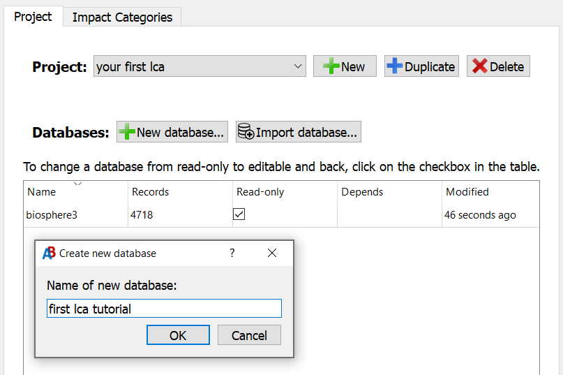
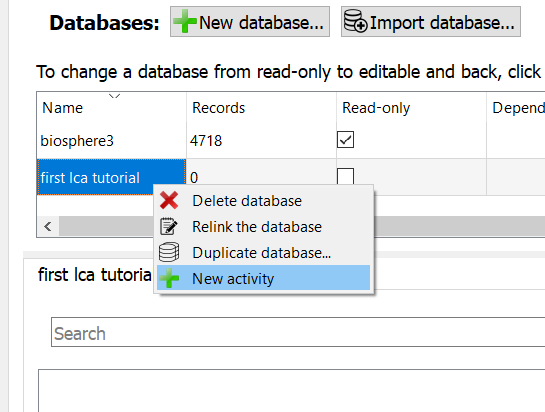
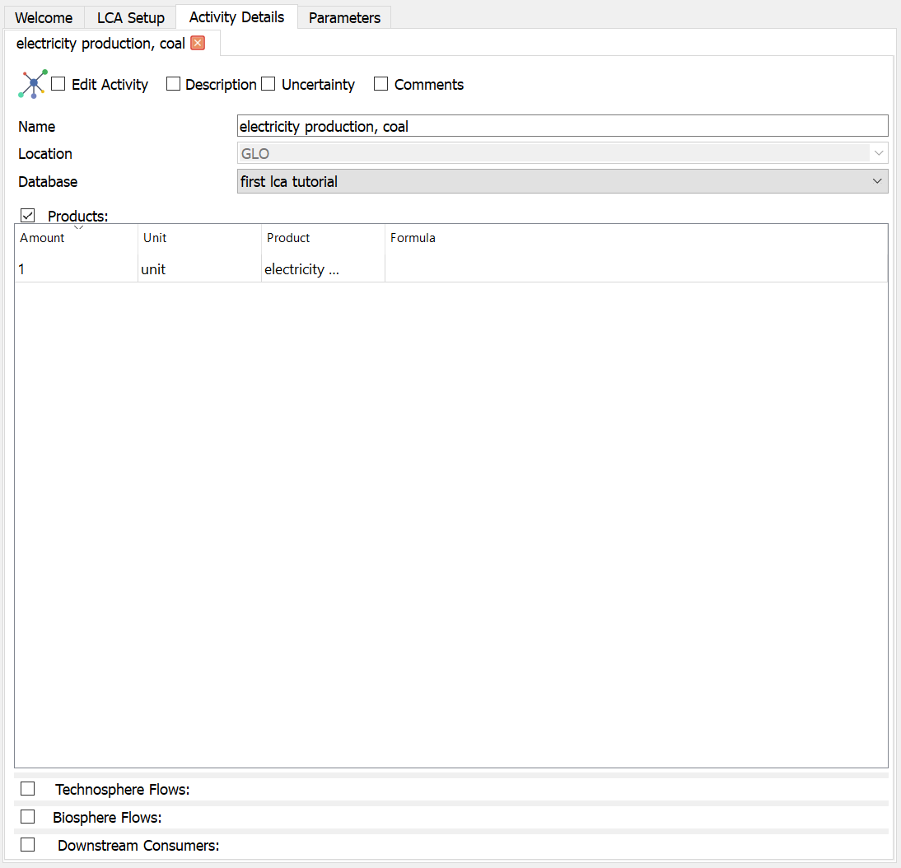
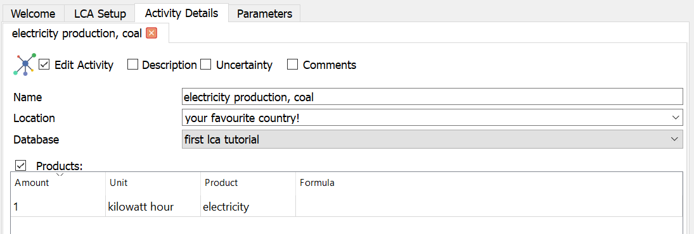
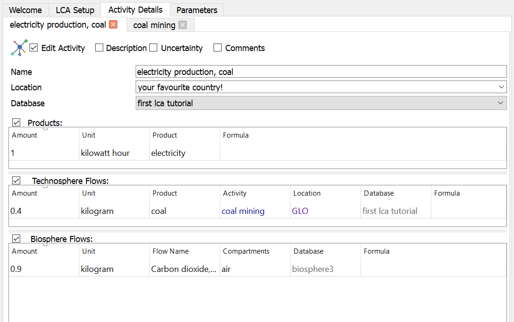
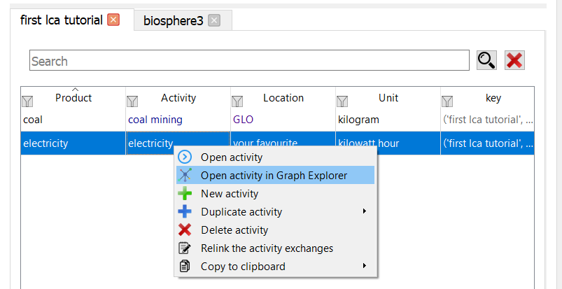
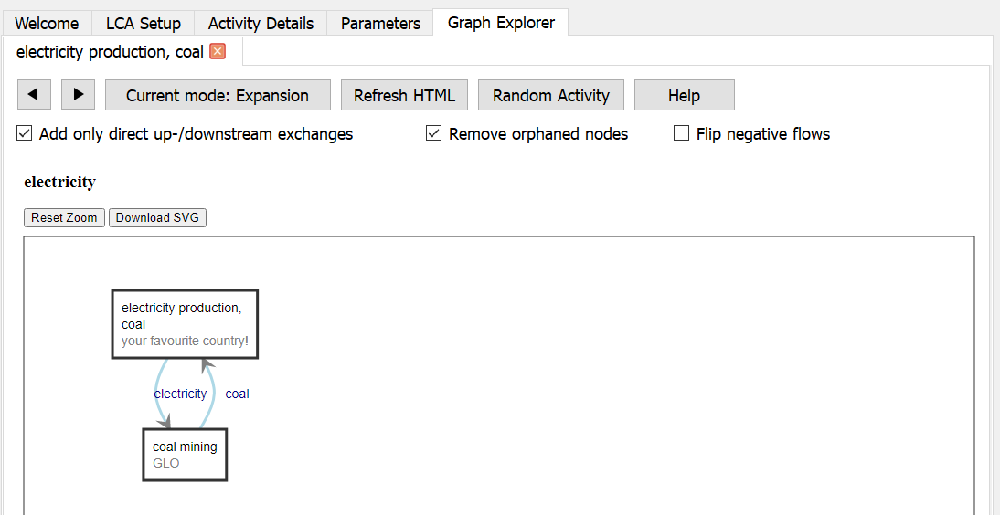
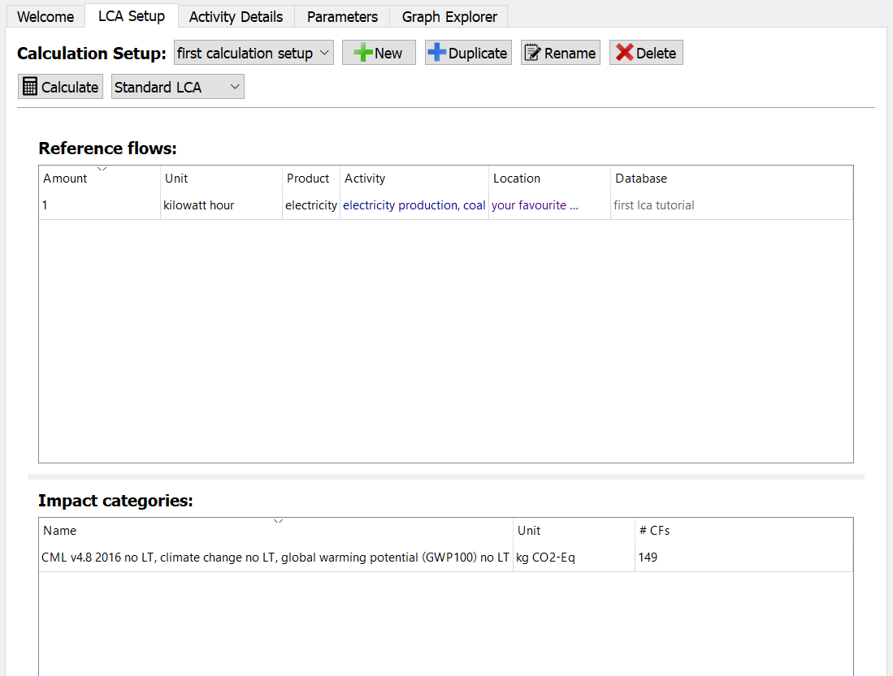
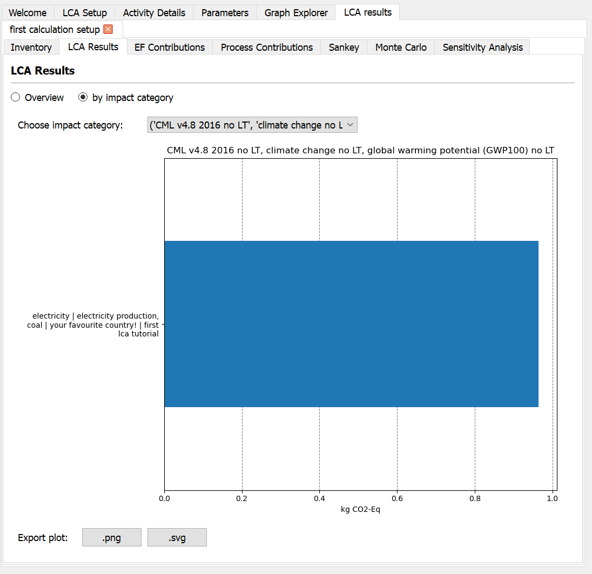

<!--
___
Tutorial topics we should cover:

General
- tutorial for searching databases (filtering data, treeview etc)
- tutorial for interpreting LCA results (overview, using contribution filters, sankey)

Managing activities and databases
- tutorial for relinking databases
- tutorial for exchanges

Uncertainty
- tutorial for adding uncertainty
- tutorial for monte carlo
- tutorial for GSA

Flow Scenarios
- tutorial for creating scenarios
- tutorial for running flow scenarios

Parameters
- tutorial for creating parameters
- tutorial for running parameter scenarios

___
Tutorial writing guidelines:
0. If needed, review https://diataxis.fr/tutorials/
1. Use the template below
2. Use first person plural (we), you are in this together with the reader
3. Make use of Github Markdown formatting for tips, warnings etc
   https://docs.github.com/en/get-started/writing-on-github/getting-started-with-writing-and-formatting-on-github/basic-writing-and-formatting-syntax
4. Make sure the 'before you start' section is correct
   Link to other tutorials/how-tos for potentially missing knowledge
5. Use a consistent formatting style for interaction items and names 
   - Refer to buttons, labels and other interactive items with `backticks`
   - Things you name in your tutorial (e.g. database name) with _'italic+quotes'_
6. Make use of screenshots/gifs, annotate them if needed
7. Link to relevant documentation sections where possible
8. Link to your new tutorial in other documentation sections where relevant
9. Update the contents section to add your tutorial

___
Tutorial template:

## Title
### What will you do
In this tutorial we will...
Write in a few sentences what reader will _do_ -not learn- by following this tutorial. 

Write the _explicit_ goal (e.g. creating a system, performing calculations etc), 
but write the tutorial by keeping in mind the _implicit_ goal of what you are teaching (e.g. learning to use AB)

### Before you start
> [!IMPORTANT]
> Make sure you have/know the following:
> - [x] [Have a working installation of Activity Browser](Installation-Guide)
> - [x] [Have a project set up](Getting-Started#setting-up-a-project) 
> - [x] ...

### 1. ...

-->

# Contents

- [General](#general)
  - [Your first LCA](#your-first-lca)

# General

## Your first LCA
### What will you do
In this tutorial we will create a simple product system and perform a calculation.
We will create a database and create activities and connect them to eachother.
Next, we will create a calculation setup and perform a calculation.

The system we will create will be a simplified system to create electricity from coal.
The data we use should not be used for any studies, it is just educational.

### Before you start
> [!IMPORTANT]
> Make sure you have/know the following:
> - [x] Know the basics of LCA
> - [x] [Know common brightway terminology](https://docs.brightway.dev/en/latest/content/overview/glossary.html)
> - [x] [Know how Brightway organizes data](Getting-Started#organization-of-data-in-brightway-and-activity-browser)
> - [x] [Have a working installation of Activity Browser](Installation-Guide)
> - [x] [Have a project set up](Getting-Started#setting-up-a-project)

### 1. Create a new database
To create a product system, we first need a place in the project where to put it.
For this, we use databases. 

- Click the `New Database...` button, this will open a popup.
- In the window, fill in the name _'first lca tutorial'_, confirm.
- We now see the new database in the `DatabasesPane` table on the left.

### 2. Create the system
Now that we have a database, we can start creating activities, which will be stored in the database.

#### 2.1 Creating activities
Lets create the first activity:
To assess the environmental impact of generating electricity from coal, we need to model the production of 
electricity and coal first.

- Right-click on your new database in the `DatabasesPane` table and choose `New activity`.

- Name your new activity _'electricity production, coal'_, confirm.
- You now see your new activity in the `Activity Details` tab on the right and in the database on the left.

This tab shows all information about an activity.

Your `Activity Details` tab should look like below:

> [!TIP]
> You can only edit activities when the database is not set to `Read-only` and the activity is set to `Edit Activity`.
> You can set these in the `DatabasesPane` table and in the top left of the `Activity Details` tab respectively.
> This is done to avoid accidental changes.
> 
> Every time you close an `Activity Details` tab, the editing state will be reset, when you open the activity again you
> need to re-enable editing to continue to make changes.
> 
> Your changes are saved automatically.
 
Now, we can fill in information in the empty activity.

- In the `Products` table, change the `Product` name to _'electricity'_ and `Unit` to _'kilowatt hour'_.
- Your changes are saved automatically when you press `Enter` or when you click somewhere else.
- Optionally set the `Location` to your favourite country, the default is `GLO` for _'global'_.

The top part of your activity should now look like this:

> [!NOTE]
> Locations and Units in Brightway and Activity Browser are 'just' text to help you organize your activities. 
> Locations and Units don't have an inherent meaning or relationships to each other.

#### 2.2 Linking activities
Now that we have one activity, we need to link a biosphere flow to it.

- In the `DatabasesPane` table in the `Project` tab on the left, open the database _'biosphere3'_ by double-clicking on it.

> [!NOTE]
> All databases that you have open in a project are shown as tabs underneath the `DatabasesPane` table.

- Search for _'carbon dioxide, fossil'_ in the database.
- In the `Activity Details` enable the (still empty) `Biosphere Flows` table by ticking the box.
- Drag the one of the _'carbon dioxide, fossil'_ biosphere flows to the `Biosphere Flows` table, the value of the `category` column does not matter right now.
- Set the `Amount` to 0.9 kilogram by double-clicking on the `Amount` field and changing the value.
  - Remember that changes are saved automatically.

> [!TIP]
> You can resize the tables in the activity details by dragging the 'splitter' between them up or down.

#### 2.3 Finishing your system
Of course, electricity cannot be generated from nothing, so we need to 
add the production of coal as a new activity to the system.

We will essentially repeat the steps in 2.1 and 2.2 with other data. 
If you are unsure about something specific, just read back to find the information.

- Create a new activity named _'coal mining'_ with as `Product` name _'coal'_ and as `Unit` _'kilogram'_.
- Again add the _'carbon dioxide, fossil'_ biosphere flow to the activity, set the `Amount` to 0.15 kilogram.
- Now switch back to the `Activity Details` of the activity _'electricity production, coal'_.
  - Remember, if you have closed this activity in the mean time, you need to re-enable the `Edit Activty` toggle.
- From the database _'first lca tutorial'_ add the _'coal mining'_ activity you just created to the 
  `Technosphere Flows` table of the _electricity production_ process.
  - Remember to show the `Technosphere Flows` table again before adding the flow.  
- Set the `Amount` to 0.4 kilogram.

The `Activity Details` of the process _'electricity production, coal'_ should look like this now:

Now, the mining of coal also takes some electricity, so we need to go back to the coal mining process 
and also add electricity as input there

- Open the _'coal mining'_ activity again and add _'electricity production'_ to the process.
- Set the `Amount` to 0.01 kilowatt hour.

#### 2.4 Inspecting your system
You have now finished creating a simple product-system for producing electricity from coal!

It is good practice to inspect if everything in developing your system went correctly.
You can inspect your system in a two ways:
1. Through the `Technosphere Flows` and `Downstream Consumers` tables in `Activity Details`.
2. Through the `Graph Explorer`.

##### Activity tables
In addition to the input flows from the technosphere and the biosphere, you can also see the 
`Downstream Consumers` table at the bottom of the `Activity Details` tab,
which are activities that consume the product your activity produces.

For the _'electricity production, coal'_ activity, you should see the flow of 0.01 kilowatt hour to _'coal mining'_.

You can further explore your system from the `Technosphere Flows` and `Downstream Consumers` tables by right-clicking 
on a flow and choosing `Open Activity`, which will open the `Activity Details` of that activity.

> [!NOTE]
> The `Downstream Consumers` table is a Read-only table, you cannot change flows from that table.
> If you want to change a flow, you need to open the activity (Right-click > `Open activity`) and change the flow. 

##### Graph Explorer
You can also look at the supply chain network visually with the `Graph Explorer`.
You can open the graph explorer in two ways: 
1. Right-clicking on an activity in a database and choosing `Open activity in Graph Explorer`.
2. In the top left of the `Activity Details` tab by clicking the `Graph Explorer` logo.

The `Graph Explorer` will show a visual representation of your system. 
If you hover on the flows (arrows), you will see the amount of the flow.

Our system should look similar to the following:

### 3 Creating a calculation setup
Now that we created a product-system, we can calculate its environmental impact.

A calculation setup exists of at least one reference product and at least one impact category. 

- On the right, open the tab `LCA setup`.
- Click `New`, name your calculation setup _'first calculation setup'_.
- On the left, find your activity _'electricity production'_ in the database we created 
  and drag it to the `Reference flows` table.
- Next, on the left, open the tab `Impact Categories` and search for _'GWP100'_ and choose one of the impact categories, 
  for this tutorial, it does not matter which one. 
- Drag it to the `Impact categories` table.

Your calculation setup should now look like this:

### 4 Running an LCA calculation
Now you are ready to calculate results.

- Click the `Calculate` button on the top left of the `LCA Setup` tab.

When Activity Browser finished the calculation, it will automatically open the `LCA results` tab on the right.
Your results should now look like this:

Congratulations! You have successfully calculated your first LCA.

> [!NOTE]
> The activities you see in there `Reference flows` table are linked to your system, if you change your system, the changes are saved automatically.
> Do keep in mind that you do need to re-calculate your results every time you make changes.

### 5 (Optional) Extending your system
The above tutorial is not completely realistic, next, we will add three optional steps:

1. Adding some detail: additional activities
2. Adding more impact categories: different ways of assessing your system
3. Adding an alternative: a different way of producing electricity

You don't need to follow all steps, but the next steps build on each other, so you need to follow them in order.

#### 5.1 Adding detail
To add detail, we will add an additional activity to produce steel.

- Create a new activity _'steel production'_ and make the `Product` name 'steel' and as `Unit` 'kilogram', set the `Amount` to 2.
- Producing steel itself emits some carbon dioxide, but we also need some coal.
- Add a coal input of 0.5 kilogram and a carbon dioxide flow of 0.5 kilogram

If you don't recall exactly how to add these, go back to step 2.1-2.3 above.

Producing electricity does not require steel directly, but of course machines and a building would be needed.
We can represent this in LCA with a very small flow of steel to other processes to represent the depreciation of the machines.

- Add a _'steel'_ flow of 0.001 kilogram to both _'electricity production, coal'_ and _'coal production'_
- Now recalculate your results (step 4 above).

You have now extended your system!
If you want, you can add more activities and flows to make your system more realistic.

#### 5.2 Adding more impact categories
LCA often compares products based on different categories, not just climate change impact, 
we will add an additional impact category to measure water use. 

First, lets add an impact category to the calculation setup

- In the impact categories and search _'water use'_ and add it to the calculation setup.

If you don't recall exactly how to do this, go back to step 3 above.

Even though we just added the impact category, we can't yet calculate results.
This is because our system does not yet have any water flows, so the impact would be zero.
We will now add the water use biosphere flow to the system and then re-calculate results.

- Search in the _'biosphere3'_ table for _'water'_
- You will see _many_ results, we don't want to search through all of these results, but we can manually filter the results further.
- In the column `Categories`, click the funnel button and write _'air'_.
- Activity Browser will filter all results in the column `Categories` for entries that contain _'air'_.
- Now you have much fewer results
- Choose the flow _'water'_, _'air'_ and add it to the activity _'electricity production, coal'_, set the `Amount` to 0.0001

Now, we can re-calculate the results
 
- Go to the `LCA Setup` tab and re-calculate the results.
- In the top of the `LCA Results` tab you can `Choose impact category`, where you can switch to the water use.
- You can now see the impact of water use on your system.

You have now added a new impact category!
If you want, you can add more flows and impact categories to make your system more realistic and assess different kinds of impacts.

#### 5.3 Adding an alternative
LCA often compares different alternatives as well, we will add an alternative way of producing electricity to compare the two.

We will add an alternative production of electricity, based on natural gas

- Create a new activity _'natural gas production'_ and make the `Product` name 'natural gas' and as `Unit` 'megajoule'.
- Add an input of 0.002 kilogram of _'steel'_.
- Add a biosphere flow of _'methane, fossil'_ (choose one) of 0.01 kilogram.
- Create a new activity _'electricity production, natural gas'_ and make the `Product` name 'electricity' and as `Unit` 'kilowatt hour'.
- Add an input of 10 megajoule of _'natural gas'_ and 0.002 kilogram of _'steel'_.
- Also add a biosphere flow of _'carbon dioxide, fossil'_ of 0.7 kilogram.

If you don't recall exactly how to add these, go back to step 2.1-2.3 above.

We now have two different ways of producing electricity, from coal and natural gas.

- Now, add the _'electricity'_ flow from _'electricity production, natural gas'_ to the calculation setup.

If you don't recall exactly how to do this, go back to step 3 above.

Finally, we can now re-calculate the results and compare these two alternatives.

- Calculate the results
- Switch to the impact category _'water use'_ (as you did in step 5.2)
  - You will see that there is some water impact from the natural gas-based electricity.
    This is because the steel we use in these activities is made with electricity from coal, which affects the impact.

You have now added a new alternative!
If you want, you can add more alternatives to make assess different methods of electricity production.
