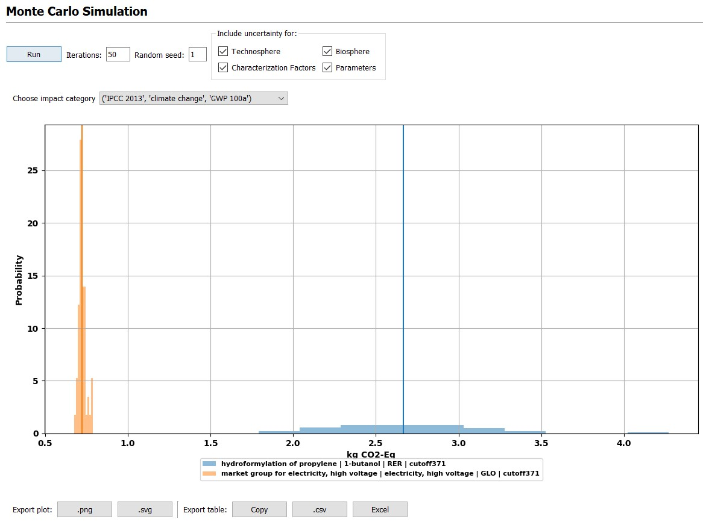
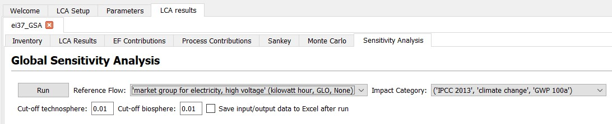

> [!IMPORTANT]
> This wiki section is __incomplete__ or __outdated__.
> 
> Please help us improve the wiki by reading our
> [contributing guidelines](https://github.com/LCA-ActivityBrowser/activity-browser/blob/main/CONTRIBUTING.md#wiki).

## Uncertainty

___
## Monte Carlo simulation
[Monte Carlo Simulation](https://en.wikipedia.org/wiki/Monte_Carlo_method) is method that relies on repeated random sampling of data to produce numerical results for uncertain input data. In LCA, economic and environmental flows as well as other data such as characterization factors or parameters may include uncertainty information (e.g. mathematical distributions or pedigree scores). During Monte Carlo simulation, random samples of this data are generated to calculate LCA results. 

In the Activity Browser, Monte Carlo Simulation can be used. The **steps **for this are:
1. To create a [calculation setup](https://github.com/LCA-ActivityBrowser/activity-browser/wiki#creating-a-calculation-setup) and perform a (static, i.e. non-stochastic) LCA. 
2. Then the user should go to the `Monte Carlo` tab
3. Then the following settings are available

* Here the users needs to specify the number of **iterations** (we recommend to start with at least 100). 
* A **random seed** can be determined, which can be used to reproduce the same random values again. 
* Finally, the user interface provides the option for **including or excluding uncertainty information** at the level of the technology matrix (technosphere), the interventions matrix (biosphere), the characterization factors, and parameters (if any have been defined by the practitioner). 

An example for Monte Carlo Simulation results are shown below.

___
## Global Sensitivity Analysis
### Overview
Global Sensitivity Analysis (GSA) is a family of methods that aim to determine which input variables are contributing the most to variations in the outcome of a stochastic model. In the context of Life Cycle Assessment (LCA), this means that GSA aims at identifying those variables (e.g. economic flows, environmental flows, characterization factors, or parameters) that due to their uncertainty distributions affect LCA results most. This provides the LCA practitioner with a shortlist of important variables for his model. For some of these variables, it may be possible to collect additional data to reduce uncertainties, which may then reduce the overall uncertainties of the LCA results. 
 
The **AB implements the delta-moment independent method** to calculate the global sensitivities. The approach is described in detail in our [scientific paper](https://onlinelibrary.wiley.com/doi/10.1111/jiec.13194). Our implementation uses the Sensitivity Analysis Library [SALib](https://github.com/SALib/SALib).

Here we describe the basic steps for performing GSA with the Activity Browser. 

### Step 1: creating a calculation setup and calculating LCA results
[How to create a calculation setup](https://github.com/LCA-ActivityBrowser/activity-browser/wiki#creating-a-calculation-setup)

### Step 2: performing Monte Carlo Simulation
Monte Carlo simulation needs to be performed in order to obtain sampled data for the LCA inputs (economic and environmental flows, characterization factors, and parameters) and the corresponding LCA results, which, together, form the required input data for the GSA. A description of how to perform Monte Carlo Simulation in the AB is provided [here](https://github.com/LCA-ActivityBrowser/activity-browser/wiki/Monte-Carlo-Simulation).
 
### Step 3: Global Sensitivity Analysis
Now the user can go to the `Sensitivity Analysis` tab to perform GSA. The figure below shows the options the user has at this level. 
* While the Monte Carlo Simulation was performed for all reference flows and impact categories at once, the GSA is performed for one reference flow and impact category at a time. This means that the user needs to **select the reference flow and impact categories** that he is interested in. GSA can be repeated later for other reference flows or impact categories based on the same Monte Carlo Simulation results. 
* The user can specify the **cut-off values **used for flows in the A (technosphere) and B (biosphere) matrices. 
* Finally, the user can **select to export both input and output data** to the GSA. If the user does not select this option, he will later only have the option to export the output data.

After the GSA is performed, the user will see a table with all input variables (environmental, economic flows, characterization factors and parameters) sorted by their delta value, which is the result of the GSA and characterizes their overall relevance. Additional data and metadata is also provided in the table.

