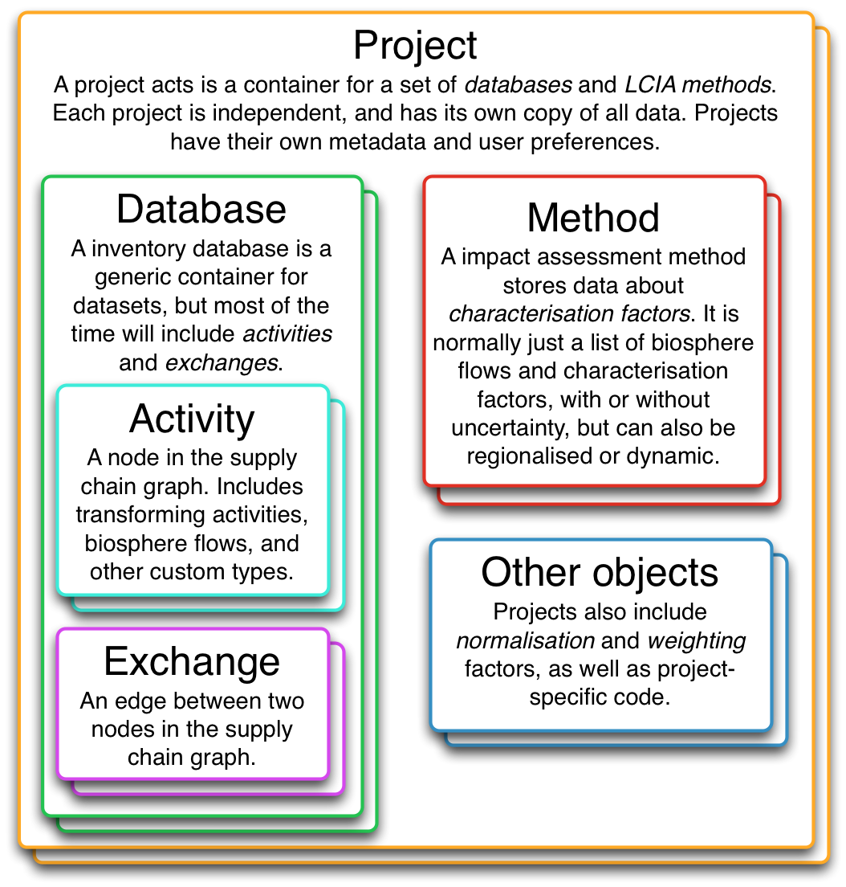

# The structure of a Brightway project
{: .fs-9 }

Projects contain a large number of different objects. From databases, to impact categories, to parameters.
{: .fs-6 .fw-300 }

Data in Brightway is structured in a hierarchy. At the top level, we have projects. A project is self-contained, with its own copy of data, LCIA methods, calculations, assumptions, and any other data you need. Each project is completely independent of other projects. Projects are saved as subdirectories in the file system.

