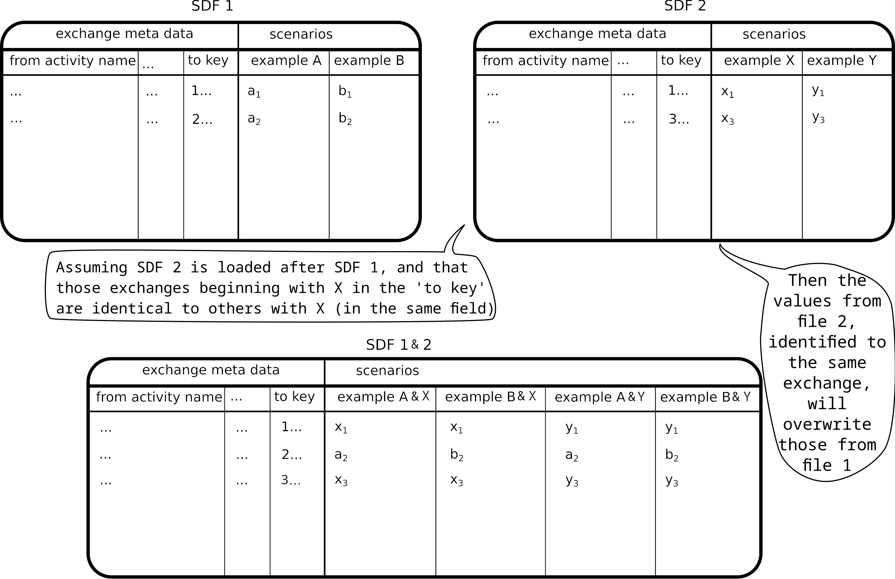
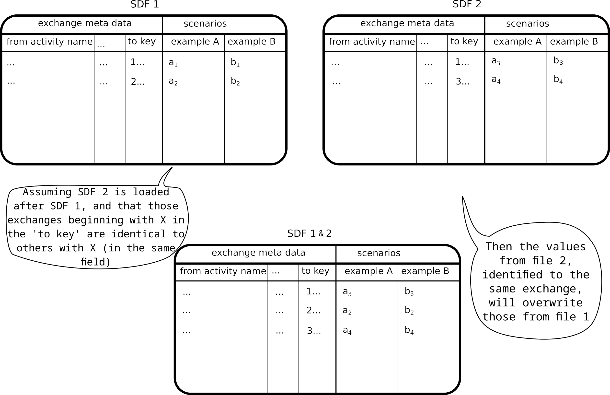

# LCA calculations for different scenarios
{: .fs-9 }

Scenario calculations are a powerful way to explore how changes in your model can impact the results.
{: .fs-6 .fw-300 }

What if you want to know how the environmental impact of a product changes if you switch to a different material, or if you improve the efficiency of a process? Scenario calculations allow you to easily compare different versions of your model without having to create separate projects for each scenario.

Activity Browser supports scenario calculations by allowing you to import scenarios into your calculation setup. At calculation time Activity Browser then substitutes the original technosphere matrix values with the ones found in your scenario files.

## Types of scenarios

There are currently two ways to define scenarios:
1. Parameter scenarios
2. Flow scenarios

### Parameter scenarios
Parameter scenarios allow you to change the values of parameters defined in your model. This is useful for creating a clear and concise representation of changes that can be easily understood. For example, you might have a parameter called "electricity efficiency" that defines the efficiency of an electric motor. You can create a scenario that changes this parameter to see how it affects the overall environmental impact of your product.

When you import a parameter scenario into a calculation setup, the Activity Browser will sample all edges affected by the parameter changes defined in the scenario file. During calculation, the sampled values will be used instead of the original values in the technosphere matrix.

### Flow scenarios
Flow scenarios allow you to directly change the values of flows in the technosphere matrix. This is useful for making specific changes to your model that may not be easily represented by parameters. For example, you might want to change the amount of a specific material used in a process or switch to a different supplier.

When you import a flow scenario into a calculation setup, the Activity Browser will directly substitute the values in the technosphere matrix with the ones defined in the scenario file during calculation.

## Combining or extending scenarios
You can add multiple scenarios to a calculation setup. This allows you to easily compare different versions of your model and see how changes in one scenario affect the results of another.

When adding multiple scenarios to a calculation setup, you can choose to either combine them or extend them. Combining scenarios means that the changes defined in each scenario will be applied together during calculation. Extending a scenario means that the changes defined in one scenario will be applied on top of the changes defined in another scenario.

### Combining scenarios
The option `Combine scenarios` will calculate every combination between scenarios, it adds more scenarios. 
This yields all possible scenario combinations, e.g. file 1: <i>A, B</i> and file 2: <i>X, Y</i> yields <i>A-X, A-Y, 
B-X and B-Y</i>, as shown in the figure below. 

### Extending scenarios
The option `Extend scenarios` will combine scenarios with the same name into a larger single scenario, 
it makes the existing scenarios larger.
Scenarios from file 2 extend scenarios of file 1, e.g.  file 1: <i>A, B</i> and file 2: <i>A, B</i> yields <i>A-B</i>,
as shown in the figure below.

{: .important }
> This is only possible if scenario names are **identical** in all files, e.g. everywhere <i>A, B</i>).

