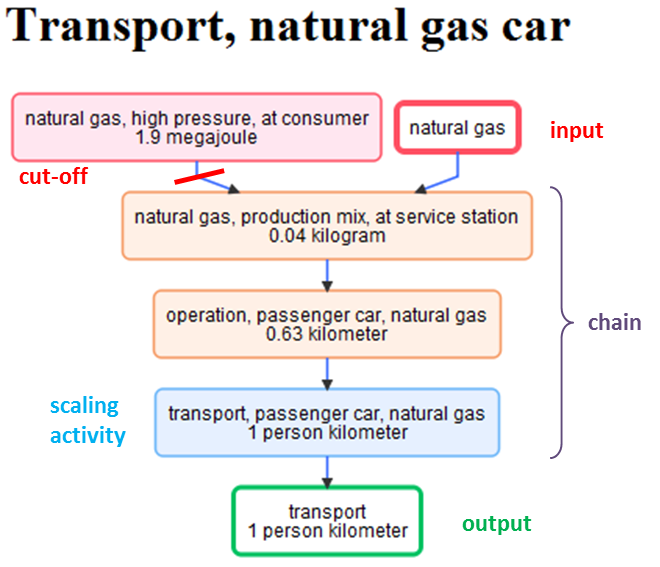
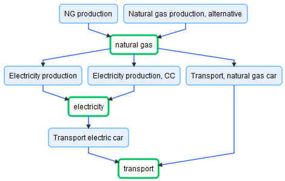

.. _introduction-metaprocesses:

Meta-Process modeling for LCA
=============================

The Meta-Process Concept enables:

- modeling inventories at a meta-level, e.g. life cycle stages 
- linking meta-processes to represent complete, possibly new life cycles
- efficient modeling of alternative life cycles
- efficient coupling of LCA and optimization

Meta-Processes
--------------

Meta-Processes can group several life cycle inventories into a single process. 

Meta-Processes *need* to have:

	* a name
	* at least one product output with a user defined name
	* at least one activity
	* a scaling activity (determined autmatically)

Meta-Processes *can* have:

	* additional processes forming the process chain
	* multiple outputs
	* multiple inputs; product inputs involve a cut-off

System of Linked Meta-Processes
-------------------------------

Linked Meta-Process Systems are created by combining meta-processes based on their product inputs and outputs. As shown in the example, the product based linking allows to efficiently specify alternative supply chains.

A detailed description of the math behind meta-processes, its application scope and examples are provided in the following paper (not yet available). 

Data Format of Meta-Processes
-----------------------------

Meta-Processes can be specified in the format shown below. It is used to define and store meta-processes.
All other properties are calculated based on this data, e.g. scaling of edges, LCA results, etc. using the methods of the MetaProcess class.

.. code-block:: python

	data_format = {
	        'name': "custom_name",
	        'outputs': [
	            (key, 'custom_name', 'custom_amount'),
	        ],
	        'chain': [
	            (key),  
	        ],
	        'cuts': [
	            (parent_key, child_key, 'custom_name', amount),
	        ],
	        'output_based_scaling': True,
	}

**Notes:**

*Keys*:
Keys are a tuple composed of two elements, where the first refers to the database and the second to the activity, thus ('database name', 'meta-process name or uuid')

*Output-based scaling*: 
The default value is *True*. If set to *False*, the scaling activities will be scaled to 1.0 no matter how the product outputs are defined by the user.This can be used to
a) to create artificial outputs that are not part of the original dataset (the user needs to see whether that makes sense)
b) when ecoinvent 2.2 multi-output activities, as imported in brightway2, are used, as these don't include the output products, which need to be manually defined.