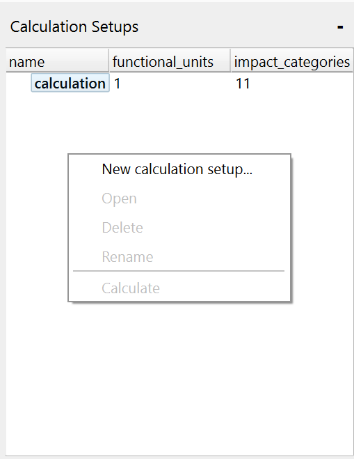

    <h1 class="fs-9">Calculation Setups pane</h1>
    
Get an overview of the calculation setups in your current project.

## Elements
### Calculation Setups View
The Calculation Setups view displays a list of all calculation setups in your project, along with how many functional units and impact categories are associated with each setup.

## Actions
### Open Calculation Setup
Open a calculation setup in the Calculation Setup Page by double-clicking the entry.

### Create New Calculation Setup
Click the "New calculation setup..." button to create a new calculation setup. You will be prompted to enter a name after which a new calculation setup will be created and opened in the Calculation Setup Page.

### Delete Calculation Setup
Right-click a calculation setup and click the "Delete calculation setup" button to remove it from your project. You will be prompted to confirm the deletion. This action cannot be undone.

### Rename Calculation Setup
Right-click a calculation setup and click the "Rename calculation setup" button to change its name. You will be prompted to enter a new name for the calculation setup.

### Calculate Setup
Right-click a calculation setup and click the "Calculate" option to initiate the calculation for the selected setup. This will directly open the Calculation Results Page once the calculation is complete.
