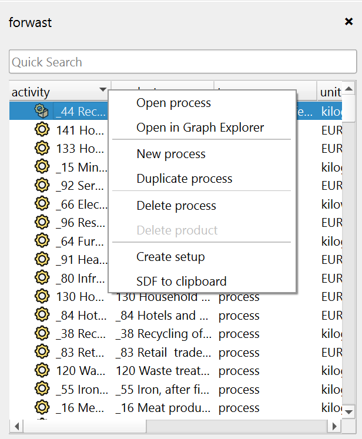

    <h1 class="fs-9">Database Products pane</h1>
    
The Database Products pane shows what nodes are in the currently selected database.

## Elements
### Quick Search
A search bar at the top of the pane allows you to quickly filter and find specific database products by typing keywords. You can also build complex queries by using an equal sign (`=`) before a Pandas query syntax.

### Products View
The Products view displays a list of all the products in the currently selected database, along with some key attributes like: type, unit, and location. If the database is based on the [Functional SQLite backend](../../advanced-topics/multifunctional-databases), only products are shown, grouped by their processors.

## Actions
### Open Process
Open a process in the Process Page by double-clicking the entry, or by right-clicking and selecting "Open process". This will open the Process Details Page, where you can view and edit the process details.

### New Process
Right-click in the Products view and select "New process" to create a new process in the currently selected database. You will be prompted to enter a name, product name, unit, and location for the new process, after which it will be created and opened in the Process Details Page.

### Duplicate Process
Right-click a process and click the "Duplicate process" button to create a copy of the selected process. After duplicating the process and its products, it will be opened in the Process Details Page.

### Delete Process
Right-click a process and click the "Delete process" button to remove it **and its products** from your project. You will be prompted to confirm the deletion. This action cannot be undone.

### Delete Product
Right-click a product and click the "Delete product" button to remove it from your project. You will be prompted to confirm the deletion. This action cannot be undone. This will not delete the process, only the selected product.

### Create Setup
Right-click a product and click the "Create setup" button to create a new calculation setup with the selected product as the functional unit. You will be prompted to enter a name for the new calculation setup, after which it will be created and opened in the Calculation Setup Page.

### SDF to Clipboard
Right-click a product and click the "SDF to clipboard" button to copy the product's SDF (Scenario Difference File) representation to your clipboard. This is useful for manually creating SDF's for [scenario calculations](../../advanced-topics/scenario-calculations.md).
