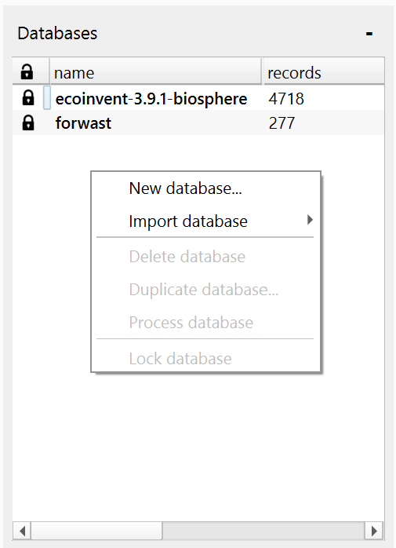

    <h1 class="fs-9">Databases pane</h1>
    
The Databases pane provides a comprehensive overview of all the databases in your current project.

## Elements
### Databases View
The Databases view displays a list of all databases in your project, along with their key attributes such as name, number of records, and last modified date.

## Actions
### Open Database
Open a database in the Database Product Pane by double-clicking the entry.

### Create New Database
Click the "New Database..." button to create a new database. You will be prompted to enter a name after which a new database will be created and opened in the Database Product Pane.

### Import Database
Click the "Import Database..." button to import an existing database file from your local machine. Supported formats are `.bw2package` and `.xlsx`. You can also import from ecoinvent.

### Delete Database
Right-click a database and click the "Delete Database" button to remove it from your project. You will be prompted to confirm the deletion. This action cannot be undone.

### Duplicate Database
Right-click a database and click the "Duplicate Database" button to create a copy of the selected database. You will be prompted to enter a new name for the duplicated database.

### Process Database
Right-click a database and click the "Process Database" option to initiate processing of the selected database into Brightway datapackages.

### Lock Database
Right-click a database and click the "Lock Database" option, or double-click the first column to prevent further modifications to the selected database. This is useful for preserving the integrity of finalized databases or background databases.
