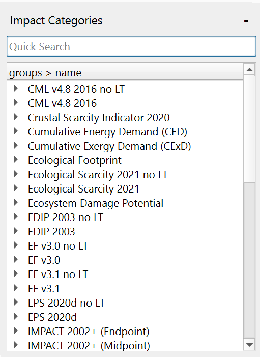

    <h1 class="fs-9">Impact Categories pane</h1>
    
Get a look at all available impact categories in your current project

## Elements
### Quick Search
A search bar at the top of the pane allows you to quickly filter and find specific impact categories by typing keywords.

### Impact Categories View
The Impact Categories view displays a list of all impact categories in your project, along with their key attributes such as name, source, and description. They are grouped by their named sections.

## Actions
### Open Impact Category
Open a database in the Database Product Pane by double-clicking the entry.
